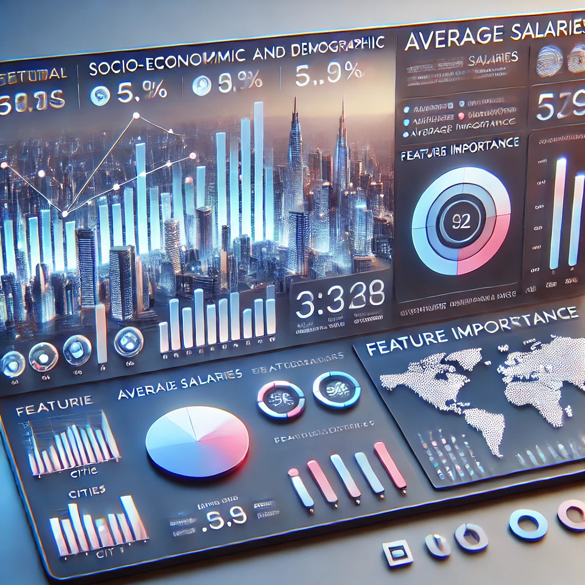

# Visualization Dashboard


## Overview

This project presents an interactive dashboard for analyzing socio-economic and demographic factors influencing average monthly salaries across cities. The dashboard provides dynamic visual tools for exploring data, identifying trends, and making data-driven insights.

🔗 **Live Dashboard**:  
[https://visualization-dashboard-2024.streamlit.app/](https://visualization-dashboard-2024.streamlit.app/)

## Key Features

- **City and Year Selection**: Choose specific cities and years to explore detailed demographic and economic data.
- **Dynamic Salary Prediction**: Adjust multiple factors via sliders to see real-time changes in predicted average salaries using a regression model.
- **Comparative Analysis**: Compare cities using interactive bar charts, pie charts, and more.
- **Interactive Map**: A visual map with data points enables geographic exploration of key statistics.
- **Feature Importance**: See which factors most influence salary predictions through model insights.

## Technologies Used

- **Python** – Core logic and data processing.
- **Streamlit** – Web interface for interactive dashboards.
- **Pandas** – Data manipulation and analysis.
- **Plotly** – Interactive charts and visualizations.
- **Folium** – Geographic mapping.

## Project Structure

- `main.py` – Main Streamlit app with dashboard logic.
- `.streamlit/` – Streamlit configuration files.
- `cities.geojson` – Geographical mapping data for Israeli cities.
- `custom_color_bar.png` – Visual asset for the color bar legend.
- `israel_cities_map_2016.html`, `2018.html`, `2020.html` – Pre-rendered city maps.
- `min_max_values_adjusted.xlsx` – Min/max feature values for slider generation.
- `out.csv`, `out_modified.csv`, `out_with_coordinates.csv` – Processed datasets.
- `regression_coefficients.xlsx` – Coefficients used in salary prediction model.
- `requirements.txt` – Required Python dependencies.
- `README.md` – Project overview and setup instructions.

## Setup Instructions

1. Clone the repository:
   ```bash
   git clone https://github.com/your-username/visualization-dashboard.git
   cd visualization-dashboard
2. Install dependencies:
   ```bash
   pip install -r requirements.txt
3. Run the dashboard:
   ```bash
   streamlit run main.py

